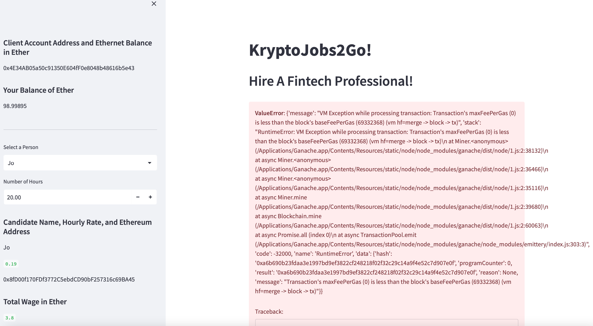

# Blockchain-Wallet

* Hire a FinTech Pro site works with sidebar

* Sidebar shows client account balance in ether 

* Drop down works to select Pro

* Can enter ether amount in box

* Send Transaction button code actually works (tested on instructor machine)

* Personal computer environment has issues

* Ganache account balances in ether pre-transaction

* Environment issue causing transaction to not register on my machine, however code did work on instructors machine (validates code works and shows there is an environment issue not solved - attempted to solve with instructors help.)

